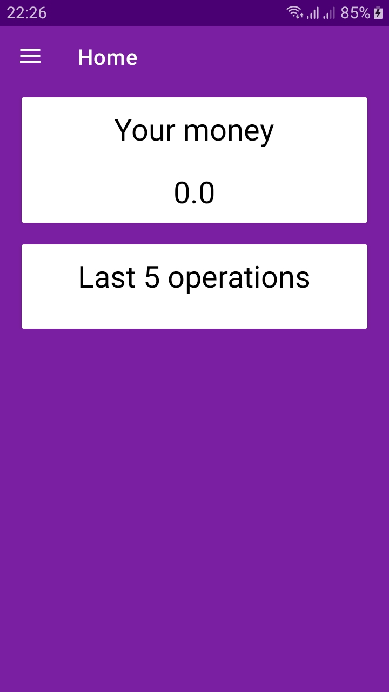
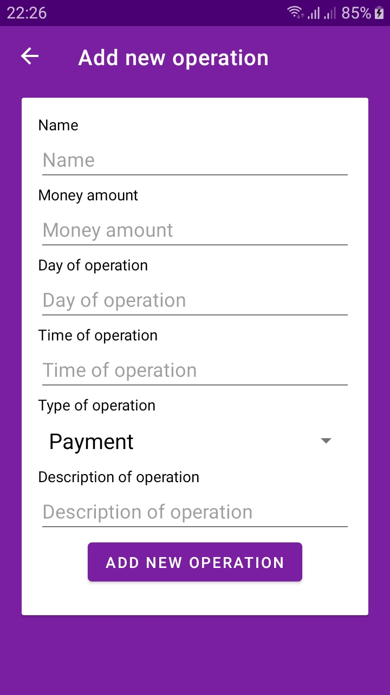
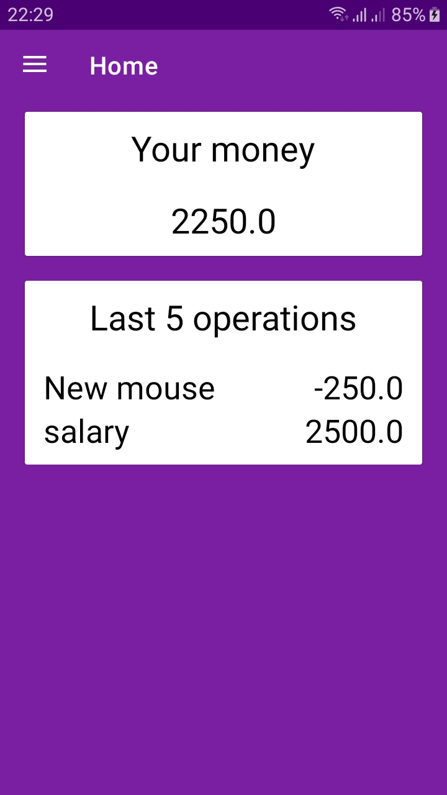
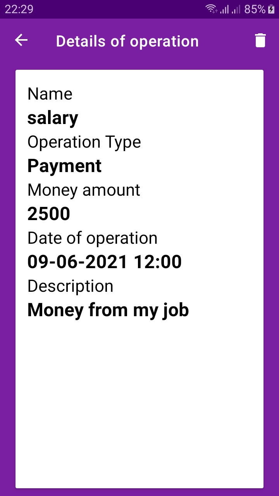
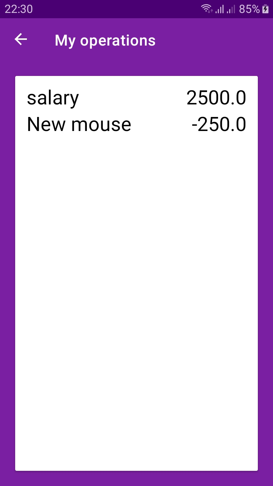

### Money Manager
Money manager is a simple app which helps organize your money operations. It helps in recording information of income as well as expenses.

### About app
Money Manager is my personal project for the class. All the information you enter into the app is stored in your device's memory. The application was developed in MVVM architecture. As a tool to store information about users I used Room Database.
This project uses the Navigation Component as a tool to manage fragments transition.

### Features

Money manager lets you:
- Add info about money operations(Payment and Payoff)
- Get info about the current amount of money
- Delete money operation information
- Get quick info on the last 5 operations
- Get list of all registered operations

### Screenshots

### Libraries

- Room Database
- Navigation Component
- Livedata and Viewmodel

